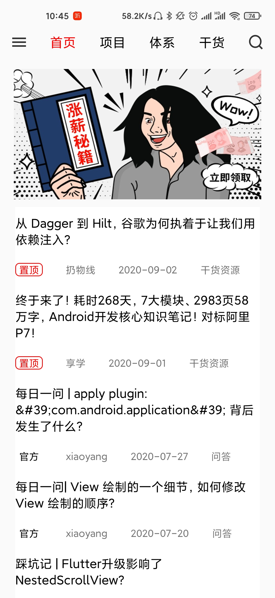
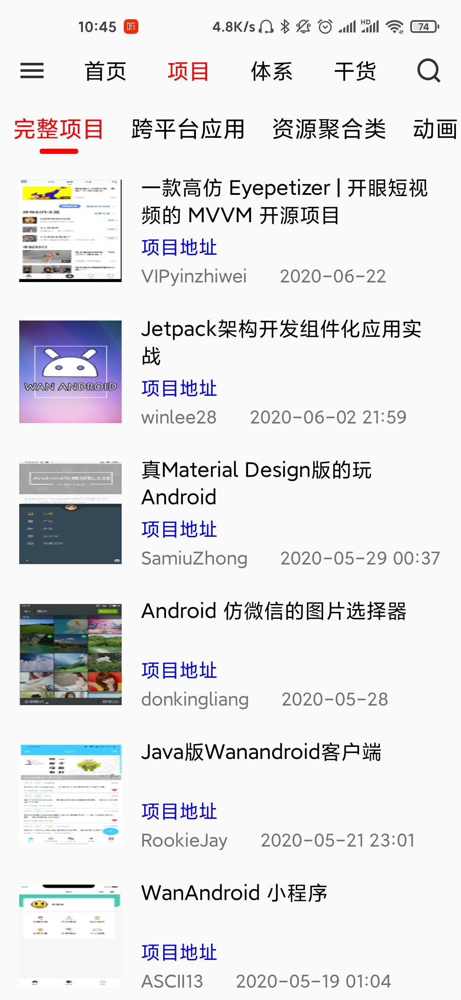
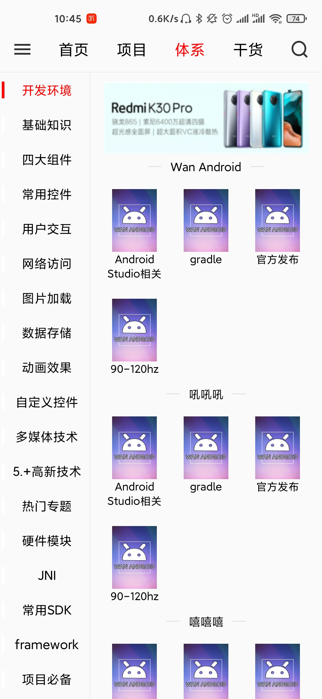
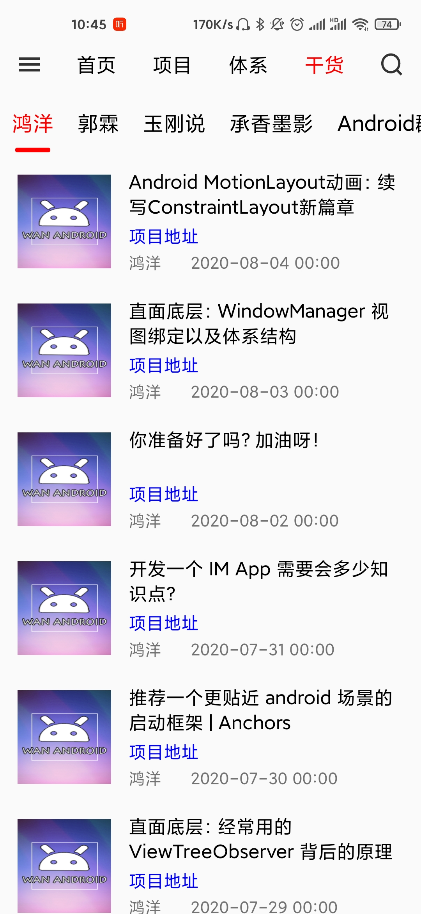
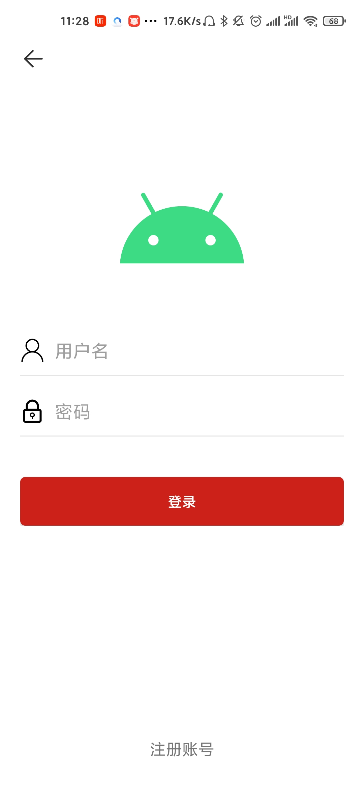

Android 资料的一个软件，基于鸿洋大佬的API，项目基于 Kotlin + MVP

​	该项目采用了 MVP 的架构，主要分为两个module，为 app 和 core。在 core 模块中完成了对一些核心类的封装，如 MVP，Dialog，View，Utils 等。

​	项目的网络库为自行封装的，目前还在逐步完善中：**[LvHttp](https://github.com/LvKang-insist/LvHttp)**

​	项目其中集成，多渠道打包，友盟，热修复，bugly，个推，小米推送等。。

效果图如下：

### 首页：

项目：

### 3：体系

使用了 RecyclerView + ViewPager2

### 4，干货

### 5：搜索：

### 6，侧滑栏

### 7，详情

8，登陆

### 使用的第三方库：

​	1，[core/build.gradle](https://github.com/LvKang-insist/WanAndroid/blob/master/core/build.gradle)

​	2，[app/build.gradle](https://github.com/LvKang-insist/WanAndroid/blob/master/app/build.gradle)
